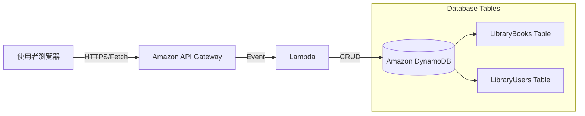
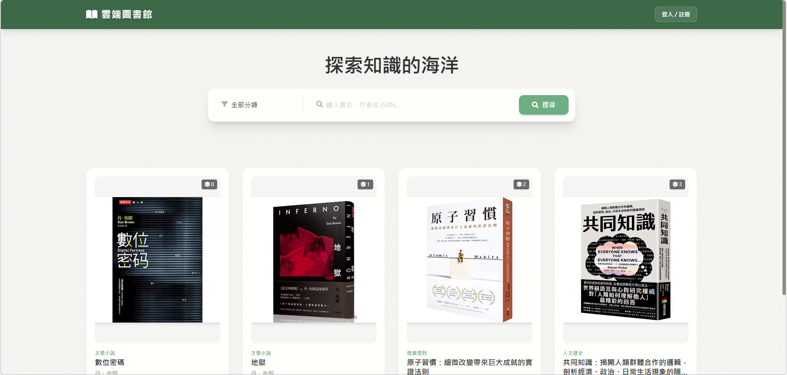
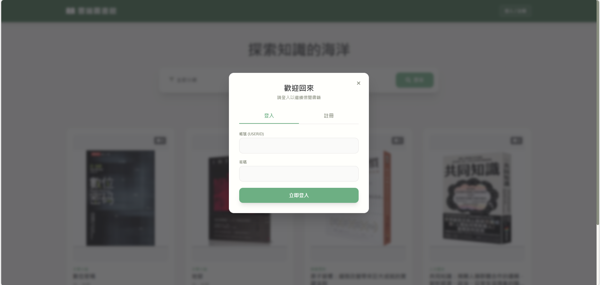
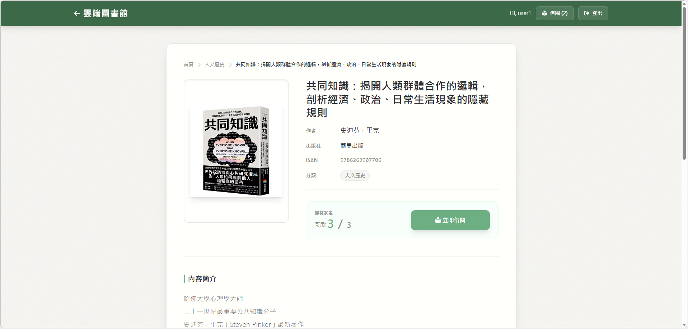
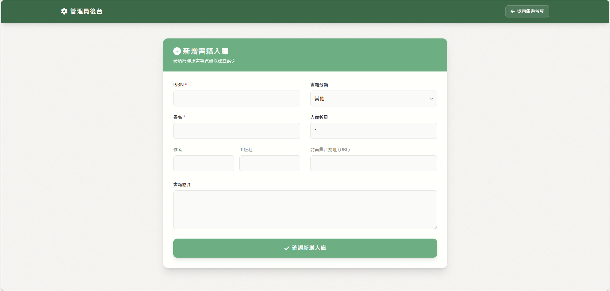
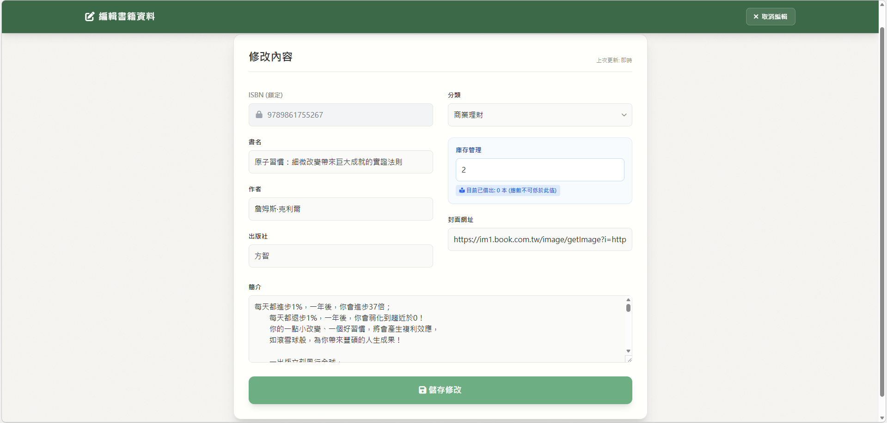
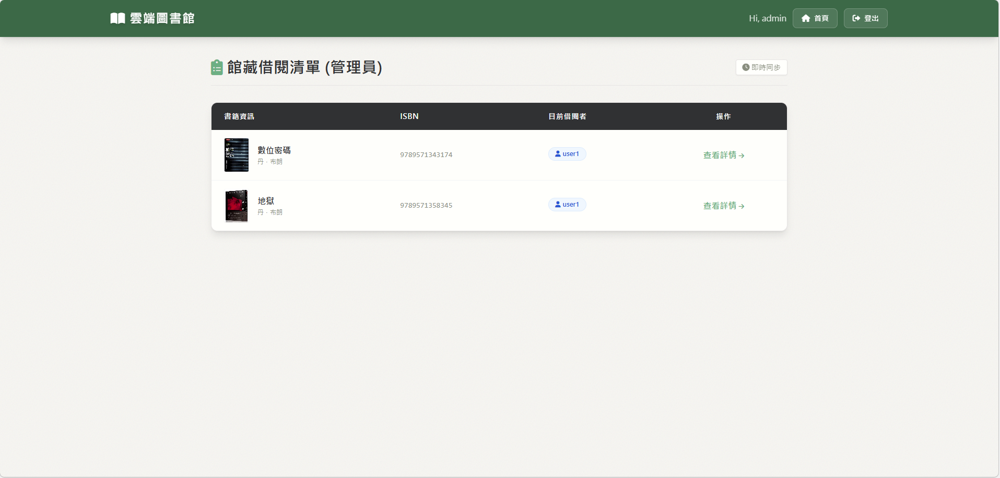
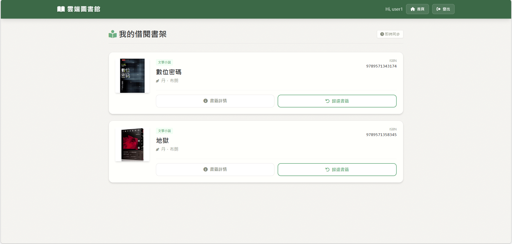
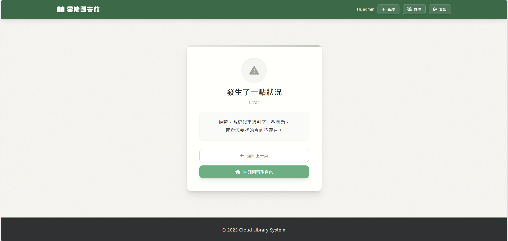

# 📚 雲端圖書館系統 (Cloud Library System)

這是一個基於 **AWS Serverless** 架構構建的圖書館管理系統。專案採用前後端分離設計，前端使用原生 JavaScript 搭配 Tailwind CSS 打造響應式介面，後端則完全託管於 AWS Lambda 與 DynamoDB，實現高擴展性與低維運成本的雲端服務。

👉 **點擊這裡開啟網頁**：http://library-system-bucket.s3-website-us-east-1.amazonaws.com
## 🌟 專案特色 (Features)

### 🎨 前端設計 (Frontend)

* **響應式設計 (RWD)**：完全支援手機、平板與桌機操作，使用 Tailwind CSS 開發。
* **動態互動**：即時的借閱/歸還狀態更新，無需頻繁刷新頁面。

### ☁️ 後端架構 (Backend & Cloud)

* **Serverless Core**：使用 AWS Lambda (Python) 處理所有程式邏輯，無需管理伺服器。
* **NoSQL Database**：使用 Amazon DynamoDB 儲存書籍與使用者資料，支援快速讀寫。
* **RESTful API**：透過 Amazon API Gateway 整合前端請求。

## 🏗️ 系統架構 (Architecture)



### 技術堆疊 (Tech Stack)

* **Frontend**: HTML5, JavaScript (ES6+), Tailwind CSS (CDN), FontAwesome
* **Backend**: Python 3.9+, Boto3 SDK
* **AWS Services**: Lambda, DynamoDB, API Gateway, S3 (Static Web Hosting)

## ⚡ 功能列表 (Functionality)

### 👤 一般會員 (Member)

* **書籍搜尋**：支援關鍵字搜尋（書名、作者）與分類篩選。
* **借閱書籍**：即時檢查庫存，一鍵借閱（防止重複借閱）。
* **歸還書籍**：在「我的書架」或書籍詳情頁歸還書籍。
* **個人書架**：查看目前借閱中的所有書籍。
* **會員註冊/登入**：簡單的身份驗證機制。

### 🛡️ 管理員 (Admin)

* **圖書入庫**：新增書籍資料（ISBN、書名、分類、總量、封面 URL）。
* **庫存管理**：修改書籍資訊與總庫存量（系統會自動計算在庫數量，防止低於目前借出量）。
* **書籍下架**：刪除書籍（具備防呆機制：若有未歸還書籍則禁止刪除）。
* **借閱監控**：查看所有書籍的當前借閱者 ID 列表。

## 📂 資料庫設計 (Database Schema)

### 1. 書籍表 (LibraryBooks)

| 欄位名稱 | 類型 | 說明 |
| --- | --- | --- |
| **ISBN** (PK) | String | 書籍唯一識別碼 |
| Title | String | 書名 |
| Author | String | 作者 |
| Category | String | 分類 (如：電腦科學、文學小說) |
| TotalCopies | Number | 館藏總數量 |
| AvailableCopies | Number | 目前在庫數量 (動態計算) |
| Borrowers | List | 目前借閱者的 UserID 列表 |
| Status | String | Available / OutOfStock |

### 2. 使用者表 (LibraryUsers)

| 欄位名稱 | 類型 | 說明 |
| --- | --- | --- |
| **UserID** (PK) | String | 帳號 |
| Password | String | 密碼 |
| Name | String | 顯示名稱 |
| Role | String | Member / Admin |
| BorrowedBooks | List | 目前借閱的 ISBN 列表 |

## 🚀 API 接口說明 (API Endpoints)

所有請求透過單一 Lambda 函數路由處理：

| Method | Path | 描述 |
| --- | --- | --- |
| **GET** | `/books` | 搜尋書籍 (支援 `?category=` 與 `?q=`) |
| **GET** | `/books/{isbn}` | 取得單一書籍詳情 |
| **POST** | `/register` | 註冊新帳號 |
| **POST** | `/login` | 使用者登入 |
| **POST** | `/books/{isbn}/borrow` | 借閱書籍 |
| **POST** | `/books/{isbn}/return` | 歸還書籍 |
| **POST** | `/admin/books` | (Admin) 新增書籍 |
| **PUT** | `/admin/books/{isbn}` | (Admin) 修改書籍資訊/庫存 |
| **DELETE** | `/admin/books/{isbn}` | (Admin) 刪除書籍 |

## 🛠️ 安裝與部署 (Setup & Deployment)

### 1. AWS 資源配置

1. **DynamoDB**: 建立兩張資料表 `LibraryBooks` (Partition Key: ISBN) 與 `LibraryUsers` (Partition Key: UserID)。
2. **Lambda**: 建立 Python 函數，建立 `lambda_function.py` 內容，賦予 DynamoDB 讀寫權限 (IAM Role)。
3. **API Gateway**: 建立 REST API，設定 Proxy Integration 指向 Lambda，並啟用 CORS。

### 2. 前端配置

```javascript
const CONFIG = {
    API_URL: "https://b87bcevz08.execute-api.us-east-1.amazonaws.com/prod",
    
    CATEGORIES: [
        "電腦科學",
        "文學小說",
        "商業理財",
        "人文歷史",
        "語言學習",
        "其他"
    ]
};

```


## 📸 畫面截圖 (Screenshots)
* **首頁 (Home)**: 搜尋與卡片式列表展示。

* **登入介面 (Login)**: 搜尋與卡片式列表展示。

* **書籍詳情頁 (Detail)**: 書籍詳細資訊與借還按鈕。

* **管理員帳號 (Admin)**: 新增書籍的表單。

* **管理員帳號 (Admin)**: 編輯書籍的表單。

* **管理員帳號 (Admin)**: 查看書籍的借閱者。

* **使用者帳號 (User)**: 查看自己借閱的書籍。

* **錯誤處理頁面 (Error)**: 錯誤頁面顯示。



